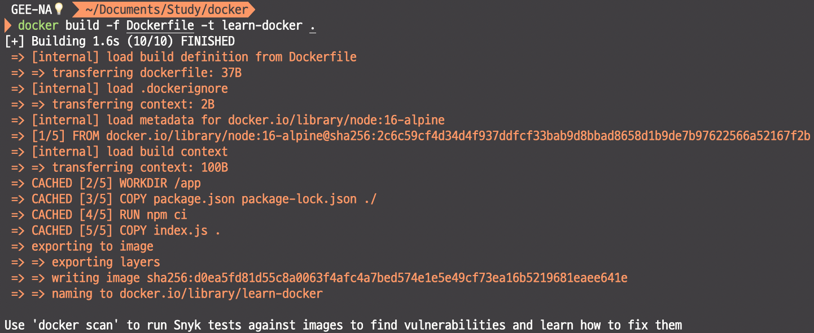
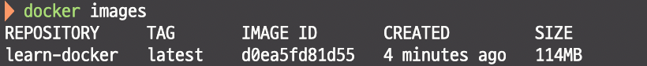
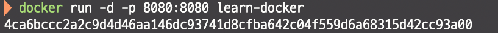
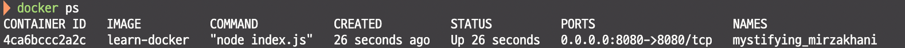
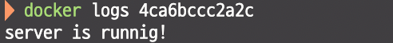
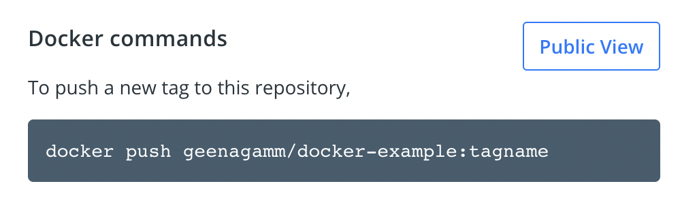
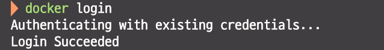
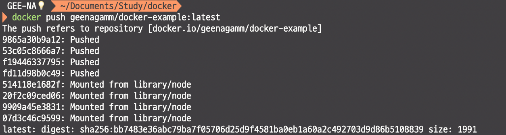

<div align="center"><h1>🐳 DOCKER</h1></div>

**[DOCKER]**
```
1.Dockerfile 
 - Image를 생성하기 위한 설정 파일
 - 어플리케이션을 구동하기 위해 필요한 파일
 - 프레임워크 및 라이브러리 설치
 - 필요한 환경 변수 설정
 - 실행 설정 스크립트

2.Image
 - dockerfiile(런타임 환경 시스템 툴, 라이브러리 등)을 통해 실행되고 있는 어플리케이션의 상태를 Image로 만든다.
 - Image는 변경이 불가능한 불변의 상태
 - 레이어 저장 방식 (image가 변할 때마다 다시 다운받게 되면 image의 용량이 크기 때문에 비효율적이다. 이를 해결하기 위해 레이어 방식을 사용)

3.Container
 - 어플리케이션의 image를 독립적으로 운용할 수 있도록 다른 실행 환경과의 간섭을 막고 개별적인 파일 시스템 안에서 실행할 수 있게 해준다.
```

**[Dockerfile]**
```javascript
FROM node:16-alpine
// FROM baseImage
// docker image를 만들 땐 baseImage를 통해 만든다.
// 기본적으로 리눅스 이미지를 만드는 경우도 있고 node같은 경우 만들어져 있는 node image를 제공한다.
// 16은 node version, alpine은 리눅스의 최소 단위의 version

WORKDIR /app
// baseImage에서 어떤 경로에서 실행할 건지 명시해준다.

COPY package.json package-lock.json ./
// package.json package-lock.json 파일들을 현재 경로인 app으로 copy한다.

RUN npm ci
// dependencies를 명시하고 있는 package json을 카피해 온 다음에 명령어 RUN을 이용해 npm install을 실행하여 모든 라이브러리를 설치한다.
// npm ci로 하는 것을 권장한다. 내가 설치한 버전이랑 동일하게 적용된 상태에서 다운을 하기 때문 (버전이 달라지는 문제점을 해결할 수 있다.)

COPY index.js .

ENTRYPOINT [ "node", "index.js" ]
// ENTRYPOINT 명령어를 사용해서 node와 index.js를 실행
```

**[배포]**
<br />



<br />

```javascript
// docker 빌드
docker build -f Dockerfile -t learn-docker .
```



```javascript
//docker 이미지 목록 확인
docker images
```



```javascript
// docker 실행하기
docker run -d -p 8080:8080 learn-docker
```



```javascript
// 컨테이너 목록 확인
docker ps
```



```javascript
// 컨테이너 로그 확인 (정상적으로 동작하는지 확인)
docker logs CONTAINER ID
```

<br />

**[Image push]**

```
docker hub에 로그인 후 repository 생성
```


```
image 이름이 repository와 같아야 하기 때문에 변경해줘야 한다.
```


```javascript
// docker tag 명령어를 통해 이미지 이름을 변경해준다.
docker tag learn-docker:latest geenagamm/docekr-example:latest
```



```javascript
// push 하기 전 로그인을 해줘야 한다.
docker login
```



```javascript
// docker push
docker push geenagamm/docker-example:latest
```

**[REFERNCE]**
```
docker compose 및 명령어 등등 더 알아보고 싶으면 하단 링크 참고하기!
https://docs.docker.com/engine/reference/builder/
https://cultivo-hy.github.io/docker/image/usage/2019/03/14/Docker정리/
```